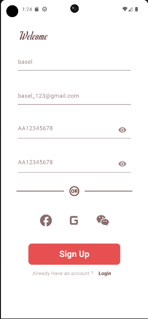
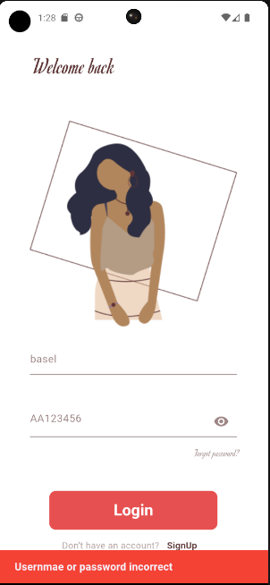
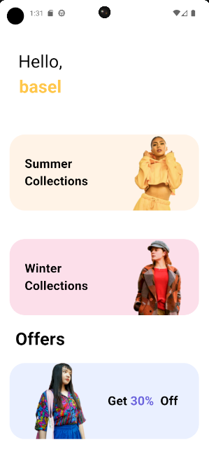
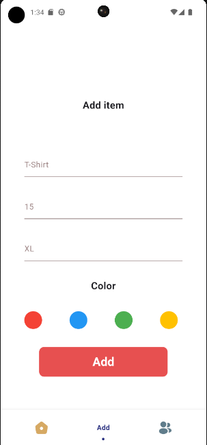
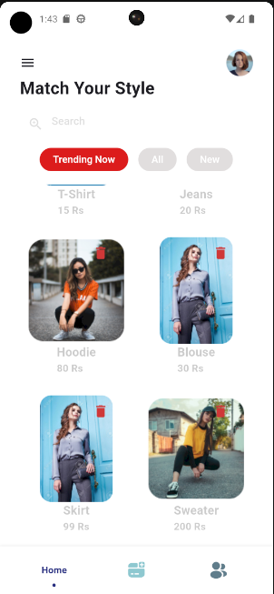
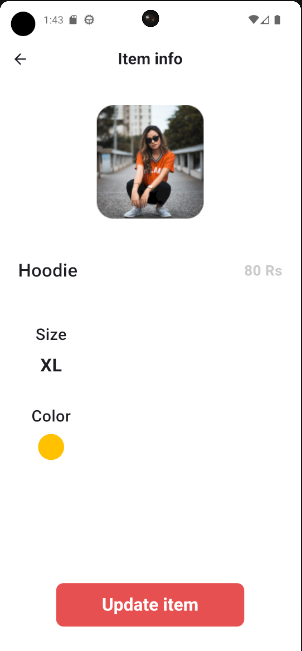
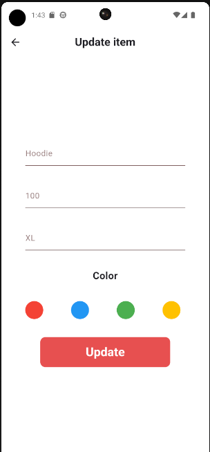
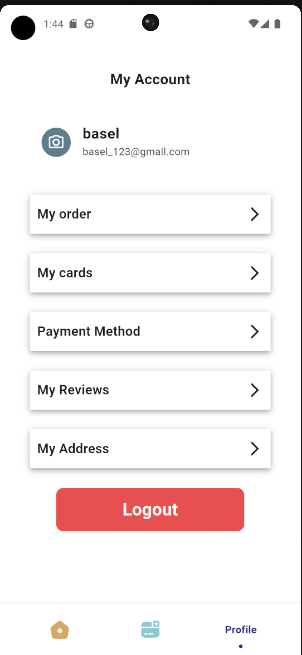

# Clothes App 👗👕

## Overview

### Purpose
The purpose of this app is to allow admin to discover and CRUD items with more features.

### Features
- **Add Item**: Admin can create and add new items.

- **Remove Item**: Admin can remove items.

- **Edit Item**: Admin can edit items.

- **Auth Function**: The app provides login & sign-up functions.

- **Local Storage**: The app stores and updates the items locally.

## Widgets & External Packages

### Main Widgets
- **TextField**: The `TextField` widget is used to allow users to input text.

- **SnackBar**: The `SnackBar` is used to show error messages to the users.

- **BottomNavigationBar**: The `BottomNavigationBar` is used to navigate between different sections of the app, such as the Feed, Saved Items, and Profile.

- **BottomSheet**: The `BottomSheet` widget is used to present a sliding panel from the bottom of the screen.

- **Builder**: The `Builder` widget is used to create a new context for the child widget.

### External Packages
- **get_it**: A simple Service Locator for Dart and Flutter projects.

- **get_storage**: A fast, extra light, and synchronous key-value in memory, which backs up data to disk at each operation. It is written entirely in Dart and easily integrates with the Get framework of Flutter.

- **Icons Plus**: A package for Flutter developers that provides a collection of attractive icons from different packs.

- **Buttons TabBar**: An open-source Flutter package that provides a tab bar where each tab indicator is a toggle button.

- **flutter_bloc**: A predictable state management library that helps implement the BLoC (Business Logic Component) design pattern

## Instructions for Running the App

### Prerequisites
- Flutter SDK

### Running the App
1. Clone the repository: 
   ```bash
   git clone https://github.com/Basel-75/Project-6.git
2. Navigate to the project directory: 
   ```bash
   cd Project-6

3. Install dependencies: 
   ```bash
   flutter pub get

4. Run the app on an emulator or connected device: 
   ```bash
   flutter run


## Output

### Screenshot











### Demo GIF


## Team

- **Basel** 

- **Anas**

- **Ammar** 

## Contact

For more information, feel free to contact us via Group-7@gmail.com or visit our GitHub profiles:
- @Basel-75
- @Anas-Aljuhani
- @Ammarx9
