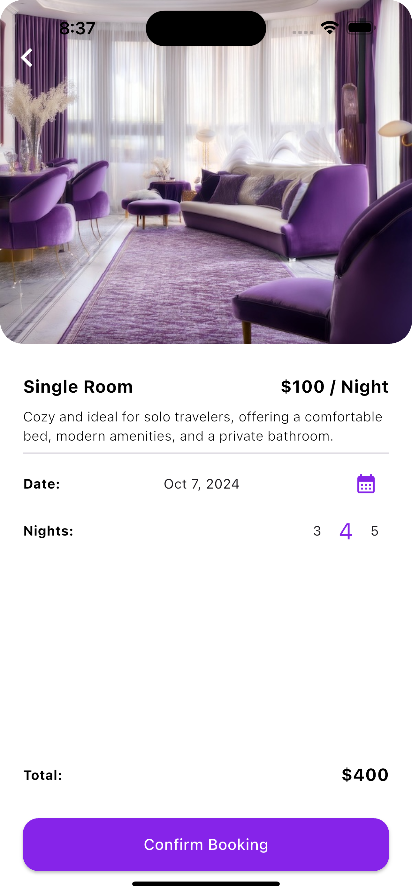
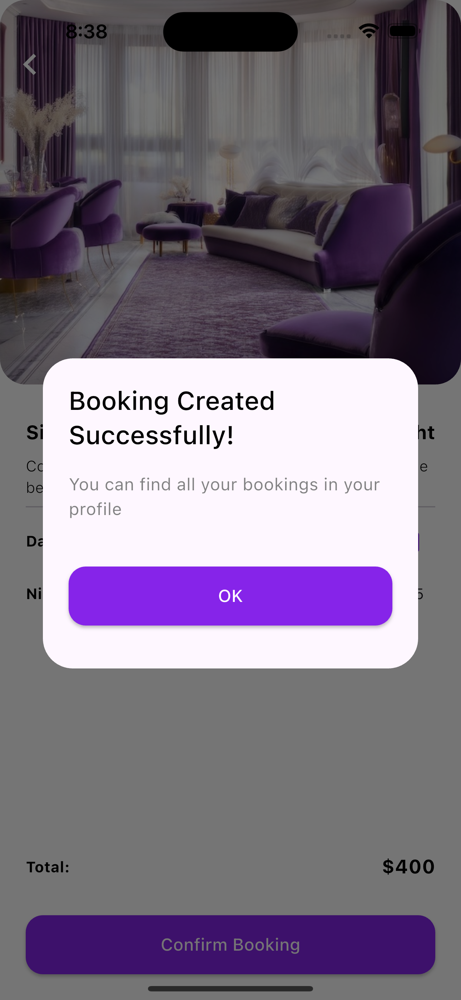
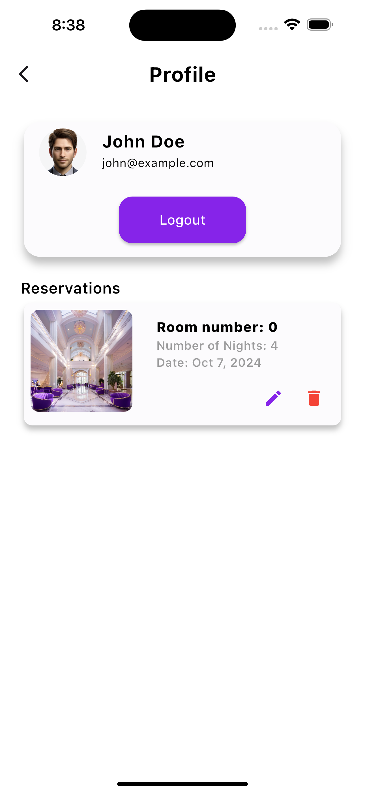

<p align="center">


# Fantasy Hotel
The `Fantasy Hotels` is a Flutter-based application uses the BLoC pattern to manage its state efficiently.Fantasy app makes booking a hotel easy. You can quickly choose your room, pick your dates, and book your stay all in one place.

## Getting Started

### Prerequisites

- Flutter SDK
- A code editor (such as VS Code or Android Studio)

### Installation

1. Clone the repository:

   ```bash
   git clone <url>
   ```

2. Navigate to the project directory:

    ```bash
   cd Project-5/blog_nest.git
   ```

3. Get the dependencies:

    ```bash
   flutter pub get
   ```

4. Run the app:
    ```bash
   flutter run
   ```


## App Overview

The Fantasy Hotels app is designed to make your hotel booking experience effortless and enjoyable. Here’s a closer look at its features:

1. **Sign-Up and Login:** Begin by creating an account with a valid email address, such as `john@example.com`, and a secure password like `John123@`. For those who prefer not to sign up, you can easily log in as a guest with default credentials. "as a default user, you can use `john@example.com `as the email and `John123@` as the password."

2. **Home Screen**: Easily explore and book a range of accommodations. Select from options such as `Single Room`, `Double Room`, `King Suite`, and `Royal Suit`e. 

3. To book a room in` Add Screen`, choose your desired check-in date, specify the number of nights, and complete your reservation with just a few taps.
Guests who wish to access additional features will be directed to the profile screen, where they will need to log in to proceed.

3. **User Profile:** In your profile, you can view your personal information, including your `Name`, `Email`, and `Avatar`. The profile section also features a logout button and a comprehensive list of all your past reservations, so you can easily `review` your booking history, `remove` and `edit`reservations in Edit Screen.

With Fantasy Hotels, booking your ideal stay is smooth and straightforward, ensuring a hassle-free travel experience.

## OutPut
The outcome of Fantasy Hotel App:

splash Login and Signup Screens:
<p align="center">


Home Screen: 
<p align="center">


Add and Edit Screens:
<p align="center">



user and guset Profile Screen:
<p align="center">



## Resourses
Packeges: https://pub.dev/

## Language and freameWorkes
- Dart programming language
- Flutter framework

## Created by
**Yara Albouq**
**Amer Alyusuf**
**Abdullah Mukhlef Al-Shammari**
